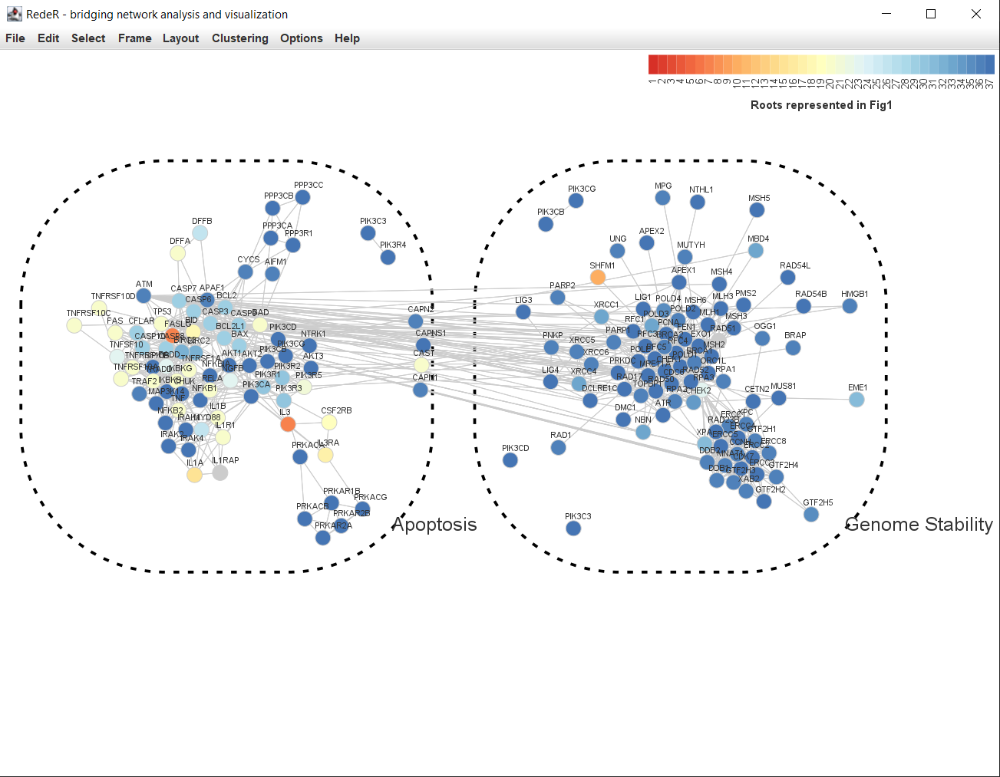
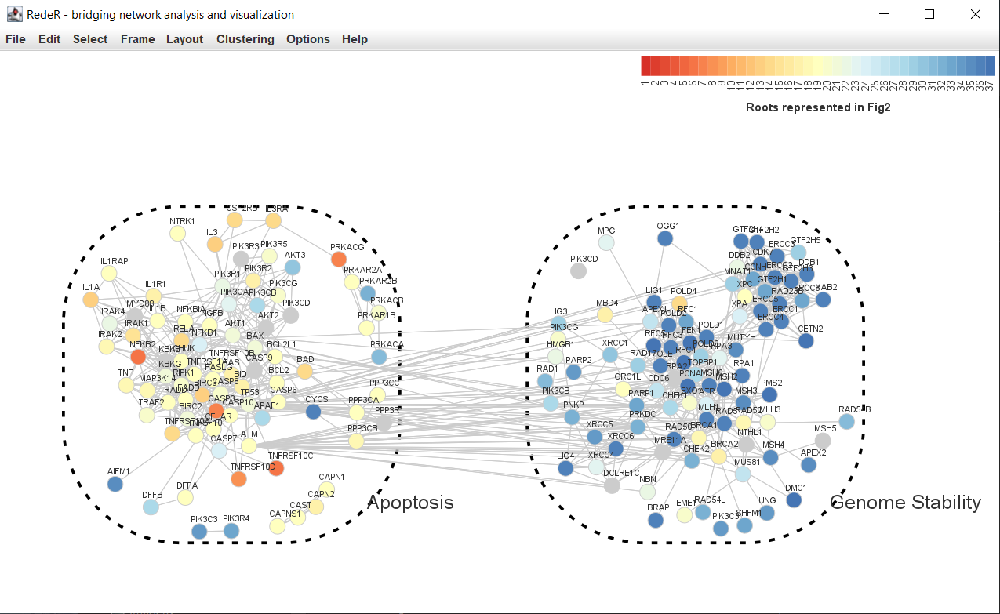
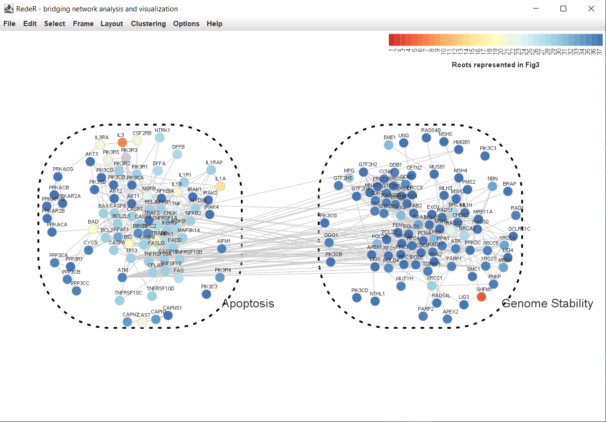

```{r setup, include = FALSE}
knitr::opts_chunk$set(
  collapse = TRUE,
  comment = "#>"
)
```

# Overview

[Geneplast](https://www.bioconductor.org/packages/release/bioc/html/geneplast.html) 
is designed for large-scale evolutionary plasticity and rooting analysis based on 
orthologs groups (OG) distribution in a given species tree.
This supporting package provides datasets obtained and processed from different 
orthologs databases for geneplast evolutionary analyses.

Currently, data from the following sources are available:

- STRING ([https://string-db.org/](https://string-db.org/))
- OMA Browser ([https://omabrowser.org/](https://omabrowser.org/))
- OrthoDB ([https://www.orthodb.org/](https://www.orthodb.org/))

Each dataset consists of four objects used as input for geneplast:

- **cogdata**. A `data.frame` mapping identifiers from OG and species to proteins/genes.
- **phyloTree**. A `phylo` object representing a phylogenetic tree where the tips' labels correspond to each species identifiers from `cogdata`.
- **cogids**. A `data.frame` containing OG identifiers from *cogdata*.
- **sspids**. A `data.frame` with species identifiers from *cogdata*.

# Quick start

Create a new `AnnotationHub` connection and query for all geneplast resources.
```{r, eval=FALSE}
library('AnnotationHub')
ah <- AnnotationHub()
meta <- query(ah, "geneplast")
head(meta)
```

Load the objects into the session using the ID of the chosen dataset.
```{r, eval=FALSE}
# Dataset derived from STRING database v11.0
load(meta[["AH83116"]])
```

# Objects creation

The general procedure for creating previously described objects starts by selecting only eukaryotes from the orthologs database with [NCBI taxonomy](https://www.ncbi.nlm.nih.gov/taxonomy) classification. 

We build a graph from taxonomy nodes and locate the root of eukaryotes. Then, we traverse this sub-graph from root to leaves corresponding to the taxonomy identifiers of the species in the database. By selecting the leaves of the resulting sub-graph, we obtain the `sspids` object.

Once the species of interest are selected, the orthology information of corresponding proteins is filtered to obtain the `cogdata` object.
The `cogids` object consists of unique orthologs identifiers from `cogdata`.

Finally, the `phyloTree` object is built from [TimeTree](http://www.timetree.org/) full eukaryotes phylogenetic tree, which is pruned to show only our species of interest. The missing species are filled using strategies of matching genera and the closest species inferred from NCBI's tree previously built.

# Working with custom data

Users are encouraged to use preprocessed datasets from `AnnotationHUB` since they've already been validated for `geneplast` analysis. However, it is possible to build customized datasets from any source of orthology information, provided they follow some requirements. This section presents an example with mock data on how to build the input data objects for `geneplast` package.

The minimal input set for running `geneplast` are: 1) a `data.frame` object **cogdata**, and 2) a `phylo` object **phyloTree**. 

The `cogdata` table maps proteins to OGs and species, and must have at least three columns: 1) a protein identifier column **protein_id**, 2) an OG identifier column **cog_id**, and a species identifier column **ssp_id**.

Suppose the user have collected orthology information between proteins from the following species:
```{r}
species <- data.frame (
    label = c("sp01", "sp02", "sp03", "sp04", "sp05", "sp06", "sp07", "sp08", "sp09", "sp10", "sp11", "sp12", "sp13", "sp14", "sp15"),
                scientific_name = c("Homo sapiens", "Pan troglodytes", "Gorilla gorilla gorilla", "Macaca mulatta", "Papio anubis", "Rattus norvegicus", "Mus musculus", "Canis lupus familiaris", "Marmosa mexicana", "Monodelphis domestica", "Gallus gallus", "Meleagris gallopavo", "Xenopus tropicalis", "Latimeria chalumnae", "Danio rerio"),
                taxon_id = c("9606", "9598", "9595", "9544", "9555", "10116", "10090", "9615", "225402", "13616", "9031", "9103", "8364", "7897", "7955")
)
species
```
The user's dataset have 3 orthologous groups identified as: *OG1*, *OG2*, and *OG3*. The proteins whithin each OG are identified by a combination of a species label plus a protein ID (ex.: *"spXX.protXx"*).
```{r}
og1 <- expand.grid(cog_id = "OG1", 
                   protein_id = c(
    "sp01.prot1a", "sp01.prot1b", "sp01.prot1c", "sp01.prot1d", "sp01.prot1e", "sp01.prot1f", "sp01.prot1g", 
    "sp02.prot1a", "sp02.prot1b", "sp02.prot1c", "sp02.prot1d", "sp02.prot1e", "sp02.prot1f", 
    "sp03.prot1a", "sp03.prot1b", "sp03.prot1c", 
    "sp04.prot1a", "sp04.prot1b", "sp04.prot1c", "sp04.prot1d", 
    "sp05.prot1a", "sp05.prot1b", "sp05.prot1c", "sp05.prot1d", "sp05.prot1e",
    "sp06.prot1a", "sp06.prot1b",
    "sp07.prot1a", "sp07.prot1b", "sp07.prot1c",
    "sp08.prot1a", "sp08.prot1b",
    "sp11.prot1a", "sp11.prot1b", "sp11.prot1c",
    "sp12.prot1a", "sp12.prot1b", "sp12.prot1c",
    "sp13.prot1a", "sp13.prot1b",
    "sp14.prot1",
    "sp15.prot1a", "sp15.prot1b"
    )
)
og2 <- expand.grid(cog_id = "OG2", 
                   protein_id = c(
    "sp01.prot2a", "sp01.prot2b", "sp01.prot2c", "sp01.prot2d", "sp01.prot2e", "sp01.prot2f",
    "sp02.prot2a", "sp02.prot2b", "sp02.prot2c",
    "sp03.prot2a", "sp03.prot2b", "sp03.prot2c", "sp03.prot2d",
    "sp04.prot2a", "sp04.prot2b", "sp04.prot2c",
    "sp05.prot2a", "sp05.prot2b", "sp05.prot2c", "sp05.prot2d",
    "sp06.prot2",
    "sp08.prot2a", "sp08.prot2b"
    )
)
og3 <- expand.grid(cog_id = "OG3", 
                   protein_id = c(
    "sp01.prot3a", "sp01.prot3b", "sp01.prot3c", "sp01.prot3d", 
    "sp02.prot3a", "sp02.prot3b", "sp02.prot3c",
    "sp03.prot3",
    "sp10.prot3"
    )
)
```
To build the **cogdata** object, the user should bind the OGs in a single `data.frame`. Furthermore, the required column **ssp_id** must be added to the data frame. In the current example, this is done by splitting the species label from the **protein_id** column and replacing it with the corresponding **taxon_id** value.
```{r}
library(tibble)
library(stringi)
library(dplyr)
# Bind OGs into a single object
cogdata <- rbind(og1, og2, og3)
# Create a dictionary to map species labels to taxon IDs
species_taxid_lookup <- species |> dplyr::select(label, taxon_id) |> tibble::deframe()
species_name_lookup <- species |> dplyr::select(taxon_id, scientific_name) |> tibble::deframe()
# Add the required ssp_id column
cogdata[["ssp_id"]] <- species_taxid_lookup[stri_split_fixed(cogdata[["protein_id"]], pattern = ".", n = 2, simplify = T)[,1]]
head(cogdata)
```
For users having OGs from standard outputs from orthology inference methods like OrthoFinder, we provide the `make.cogdata()` function to parse a tabular-separated (.tsv) file directly into the **cogdata** object.
```{r, eval=FALSE}
library(geneplast.data)
cogdata <- geneplast.data::make.cogdata(file = "path/to/orthogroups.tsv")
```

To create the **phyloTree** object, the user can use the `make.phyloTree()` function provided by `geneplast.data` package. This function has two optional arguments (`sspids` and `newick`) that define its behavior depending on which one is provided. 

Given a list of species' NCBI Taxonomy IDs `sspids`, it builds a phylogenetic tree by merging the TimeTree and NCBI Taxonomy databases:
```{r}
library(geneplast.data)
phyloTree <- geneplast.data::make.phyloTree(sspids = species$taxon_id)
phyloTree
```
Alternatively, the user could provide a `newick` file describing the species phylogenetic tree.
*Note: the tips' labels from the custom newick tree should be listed in 'cogdata' object to properly perform the analysis.*
```{r eval=FALSE}
# Create from a user's predefined newick file
phyloTree <- geneplast.data::make.phyloTree(newick = "path/to/newick_tree.nwk")
```
Plot the resulting phylogenetic tree:
```{r}
library(geneplast)
phyloTree <- geneplast:::rotatePhyloTree(phyloTree, "9606")
phyloTree$edge.length <- NULL
phyloTree$tip.label <- species_name_lookup[phyloTree$tip.label]
plot(phyloTree, type = "cladogram")
```

<b>Figure 1.</b> *Sample phylogenetic tree built with `make.phyloTree()` function*.


# Case studies: Transfer rooting information to a PPI network

This section reproduces a case study using STRING, OMA, and OrthoDB annotated datasets.

The following scripts run geneplast rooting analysis and transfer its results to a graph model. For detailed step-by-step instructions, please check the [geneplast vignette](https://www.bioconductor.org/packages/release/bioc/vignettes/geneplast/inst/doc/geneplast.html#map-rooting-information-on-ppi-networks).

## STRING

```{r, eval=FALSE}
library(geneplast)
ogr <- groot.preprocess(cogdata=cogdata, phyloTree=phyloTree, spid="9606")
ogr <- groot(ogr, nPermutations=1, verbose=TRUE)

library(RedeR)
library(igraph)
library(RColorBrewer)
data(ppi.gs)
g <- ogr2igraph(ogr, cogdata, ppi.gs, idkey = "ENTREZ")
pal <- brewer.pal(9, "RdYlBu")
color_col <- colorRampPalette(pal)(37) #set a color for each root!
g <- att.setv(g=g, from="Root", to="nodeColor", cols=color_col, na.col = "grey80", breaks = seq(1,37))
g <- att.setv(g = g, from = "SYMBOL", to = "nodeAlias")
E(g)$edgeColor <- "grey80"
V(g)$nodeLineColor <- "grey80"
rdp <- RedPort()
calld(rdp)
resetd(rdp)
addGraph(rdp, g)
addLegend.color(rdp, colvec=g$legNodeColor$scale, size=15, labvec=g$legNodeColor$legend, title="Roots inferred from geneplast")
g1  <- induced_subgraph(g=g, V(g)$name[V(g)$Apoptosis==1])
g2  <- induced_subgraph(g=g, V(g)$name[V(g)$GenomeStability==1])
myTheme <- list(nestFontSize=25, zoom=80, isNest=TRUE, gscale=65, theme=2)
addGraph(rdp, g1, gcoord=c(25, 50), theme = c(myTheme, nestAlias="Apoptosis"))
addGraph(rdp, g2, gcoord=c(75, 50), theme = c(myTheme, nestAlias="Genome Stability"))
relax(rdp, p1=50, p2=50, p3=50, p4=50, p5= 50, ps = TRUE)
```


<b>Figure 2.</b> *Inferred evolutionary roots of a protein-protein interaction network*.

## OMA

```{r, eval=FALSE}
load(meta[["AH83117"]])
cogdata$cog_id <- paste0("OMA", cogdata$cog_id)
cogids$cog_id <- paste0("OMA", cogids$cog_id)

human_entrez_2_oma_Aug2020 <- read_delim("processed_human.entrez_2_OMA.Aug2020.tsv", 
    delim = "\t", escape_double = FALSE, 
    col_names = FALSE, trim_ws = TRUE)
names(human_entrez_2_oma_Aug2020) <- c("protein_id", "gene_id")
cogdata <- cogdata %>% left_join(human_entrez_2_oma_Aug2020)
ogr <- groot.preprocess(cogdata=cogdata, phyloTree=phyloTree, spid="9606")
ogr <- groot(ogr, nPermutations=1, verbose=TRUE)

g <- ogr2igraph(ogr, cogdata, ppi.gs, idkey = "ENTREZ")
pal <- brewer.pal(9, "RdYlBu")
color_col <- colorRampPalette(pal)(37) #set a color for each root!
g <- att.setv(g=g, from="Root", to="nodeColor", cols=color_col, na.col = "grey80", breaks = seq(1,37))
g <- att.setv(g = g, from = "SYMBOL", to = "nodeAlias")
E(g)$edgeColor <- "grey80"
V(g)$nodeLineColor <- "grey80"
# rdp <- RedPort()
# calld(rdp)
resetd(rdp)
addGraph(rdp, g)
addLegend.color(rdp, colvec=g$legNodeColor$scale, size=15, labvec=g$legNodeColor$legend, title="Roots inferred from geneplast")
g1  <- induced_subgraph(g=g, V(g)$name[V(g)$Apoptosis==1])
g2  <- induced_subgraph(g=g, V(g)$name[V(g)$GenomeStability==1])
myTheme <- list(nestFontSize=25, zoom=80, isNest=TRUE, gscale=65, theme=2)
addGraph(rdp, g1, gcoord=c(25, 50), theme = c(myTheme, nestAlias="Apoptosis"))
addGraph(rdp, g2, gcoord=c(75, 50), theme = c(myTheme, nestAlias="Genome Stability"))
relax(rdp, p1=50, p2=50, p3=50, p4=50, p5= 50, ps = TRUE)
```


## OrthoDB 

```{r, eval=FALSE}
load(meta[["AH83118"]])
cogdata$cog_id <- paste0("ODB", cogdata$cog_id)
cogids$cog_id <- paste0("ODB", cogids$cog_id)

human_entrez_2_odb <- read_delim("odb10v1_genes-human-entrez.tsv", 
    delim = "\t", escape_double = FALSE, 
    col_names = FALSE, trim_ws = TRUE)
names(human_entrez_2_odb) <- c("protein_id", "gene_id")
cogdata <- cogdata %>% left_join(human_entrez_2_odb)
ogr <- groot.preprocess(cogdata=cogdata, phyloTree=phyloTree, spid="9606")
ogr <- groot(ogr, nPermutations=1, verbose=TRUE)

g <- ogr2igraph(ogr, cogdata, ppi.gs, idkey = "ENTREZ")
pal <- brewer.pal(9, "RdYlBu")
color_col <- colorRampPalette(pal)(37) #set a color for each root!
g <- att.setv(g=g, from="Root", to="nodeColor", cols=color_col, na.col = "grey80", breaks = seq(1,37))
g <- att.setv(g = g, from = "SYMBOL", to = "nodeAlias")
E(g)$edgeColor <- "grey80"
V(g)$nodeLineColor <- "grey80"
rdp <- RedPort()
calld(rdp)
resetd(rdp)
addGraph(rdp, g)
addLegend.color(rdp, colvec=g$legNodeColor$scale, size=15, labvec=g$legNodeColor$legend, title="Roots inferred from geneplast")
g1  <- induced_subgraph(g=g, V(g)$name[V(g)$Apoptosis==1])
g2  <- induced_subgraph(g=g, V(g)$name[V(g)$GenomeStability==1])
myTheme <- list(nestFontSize=25, zoom=80, isNest=TRUE, gscale=65, theme=2)
addGraph(rdp, g1, gcoord=c(25, 50), theme = c(myTheme, nestAlias="Apoptosis"))
addGraph(rdp, g2, gcoord=c(75, 50), theme = c(myTheme, nestAlias="Genome Stability"))
relax(rdp, p1=50, p2=50, p3=50, p4=50, p5= 50, ps = TRUE)
```


# Estimated computing time

This section presents elapsed times (ET) for *geneplast* rooting analysis of all OG from *H. sapiens* within different datasets (STRING, OMA, and OrthoDB). We used default values when calling the functions `groot.preprocess` and `groot`. The elapsed times were calculated by the difference of timestamps using [tictoc](https://cran.r-project.org/web/packages/tictoc/index.html) library.

```{r eval=FALSE}
library(AnnotationHub)
library(dplyr)
library(geneplast)
library(tictoc)

ah <- AnnotationHub()
meta <- query(ah, "geneplast")
load(meta[["AH83116"]])
writeLines(paste("geneplast input data loaded from", meta["AH83116"]$title))

tic("total time")
tic("preprocessing")
ogr <- groot.preprocess(cogdata=cogdata, phyloTree=phyloTree, spid="9606")
toc()
tic("rooting")
ogr <- groot(ogr)
toc()
toc()
```

We performed all runs  on a desktop computer with the following specification:

- CPU: Intel Core i7 @ 2.80GHz (7th gen.)
- RAM: 16 GB
- Disk: Samsung SSD 970 EVO (NVMe)

<b>Table 1.</b> *Elapsed times for preprocessing and rooting all human orthologs within different datasets*.

Dataset ID | Source  | Species count | OG count | ET (prep.) | ET (rooting) | ET (total)
---------- | ------- | ---- | ------ | ------------- | -------------- | --------------
AH83116    | STRING  | 476  | 7702   | 6 min 22 sec  | 10 min 50 sec  | 17 min 12 sec
AH83117    | OMA     | 485  | 19614  | 7 min 46 sec  | 26 min 58 sec  | 34 min 45 sec
AH83118    | OrthoDB | 1271 | 10557  | 19 min 3 sec  | 13 min 41 sec  | 32 min 44 sec


# Session Information

```{r}
sessionInfo()
```
